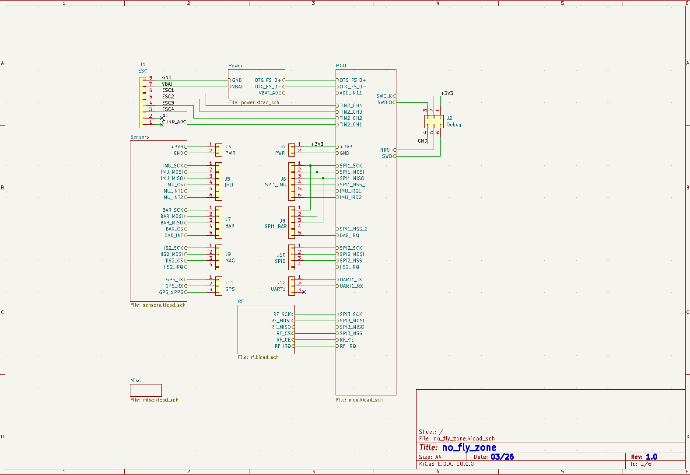
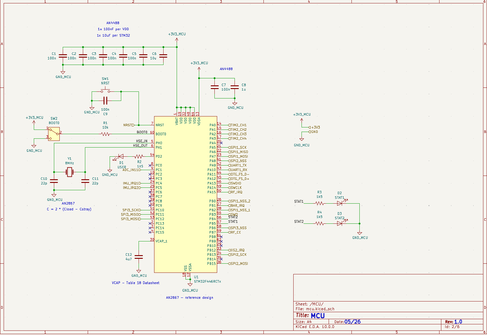
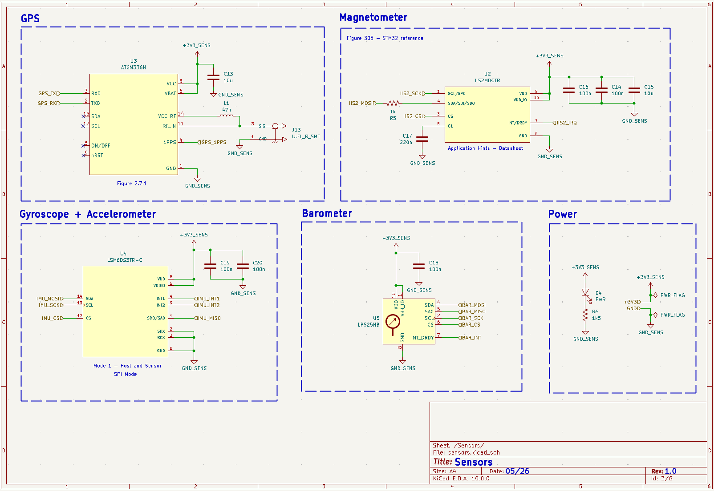
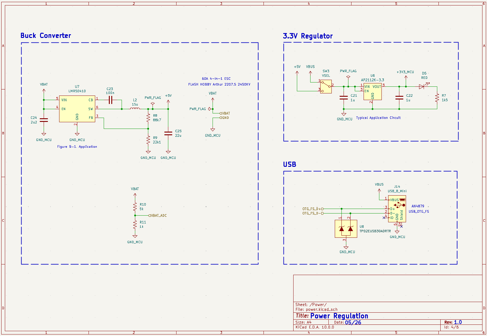
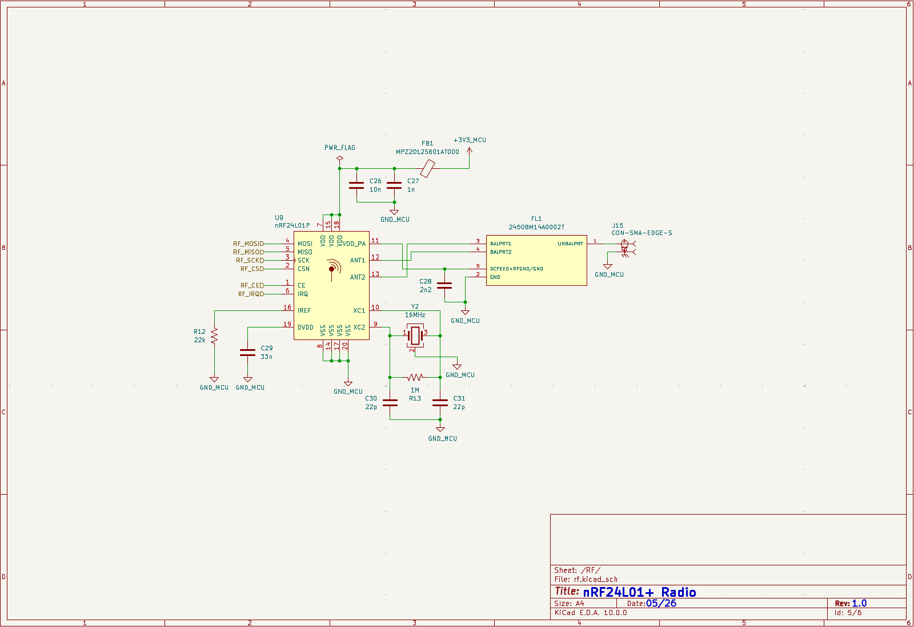
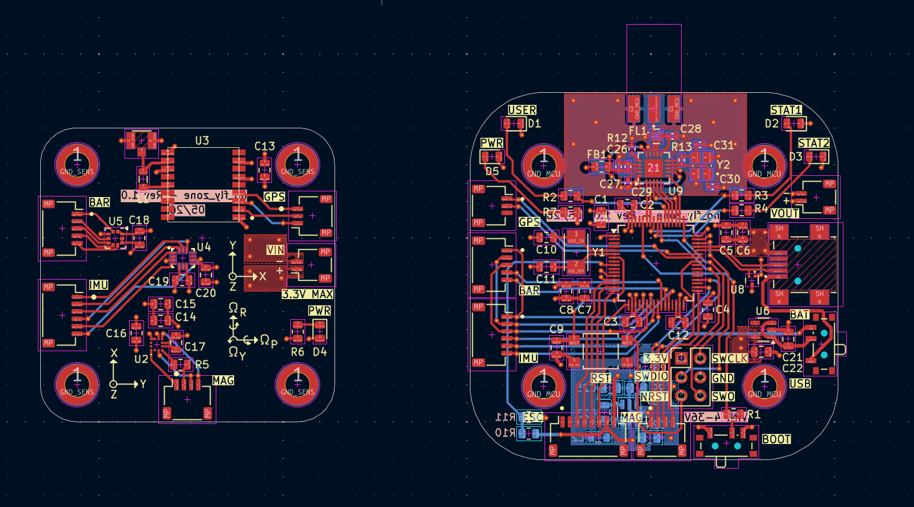
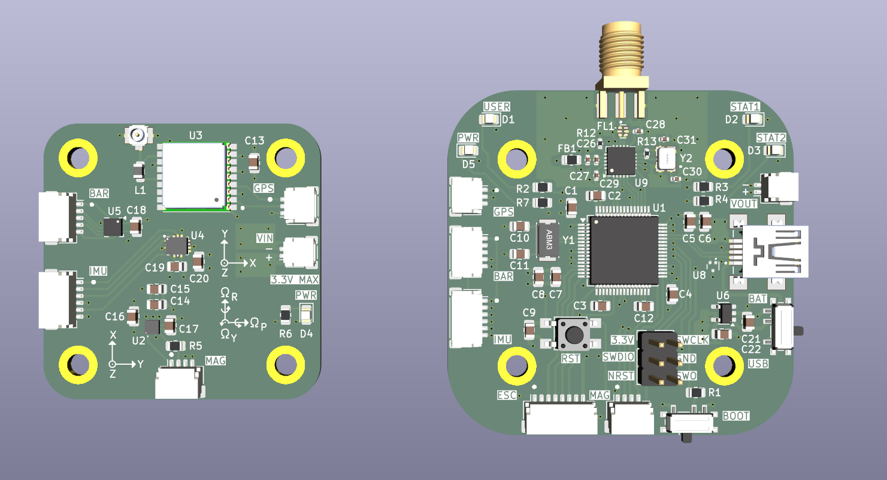

# no_fly_zone Schematic + PCB
## Overview

The quadcopter requires several components

1. Microcontroller
2. Sensor Suite
3. Radio Communication
4. Power Circuitry
5. ESC
6. Motors

The flight controller chosen was the STM32F446RCT for its high maximum clock frequency, dedicated FPU, and abundant communication modules. The sensor suite in Revision 1.0 consists of a 6DOF IMU, magnetometer, barometer, and GPS. Each of these sensors provides useful data for the flight controller. The IMU provides information on pitch and roll, magnetometer on yaw, barometer on altitude, and GPS for extended yaw support as well as location tracking for future revisions. Onboard magnetometers are very susceptible to EMF fields from motors, other sensors, as well as PCB traces. Thus, the GPS can be used as a backup for heading. 

The nRF24L01 was chosen to communicate with the remote, also using the nRF24L01. In the future, a dedicated PA + LNA chip may be added on board to extend quadcopter range.

The power circuitry consists of an onboard buck converter on the bottom side of the PCB in order to reduce noise to other components. More details below.

The ESCs and motors were purchased on amazon.com and can be seen in the parts.txt file. 

## Boards

The single schematic given here is separated into two boards. A singular board containing all components was not able to fit onto the quadcopter frame. Thus, a separate MCU board and sensor board were produced using KiKit and connectors were used to share power and communication.

## Schematics

### Hierarchal Schematic

The hierarchal schematic provides a top-level overview of the two boards. The ESC connectors, power schematic, and RF schematic were all included on the MCU board. The sensor board contains only the sensor schematic.

### MCU

### Sensors

### Power

### RF

Like the RF section on the remote, the nRF24L01 is surrounded by a continuous ground plane on the top layer as well as the layer directly underneath the antenna for stability. Stitching vias are placed about ~6mm apart (between lambda/10 - lambda/20 of 2.4 GHz wavelength) near antenna for shielding.

### Misc

Contains 8 M3 screw holes, 4 for each board. Not shown for brevity.

### PCB

### 3D

