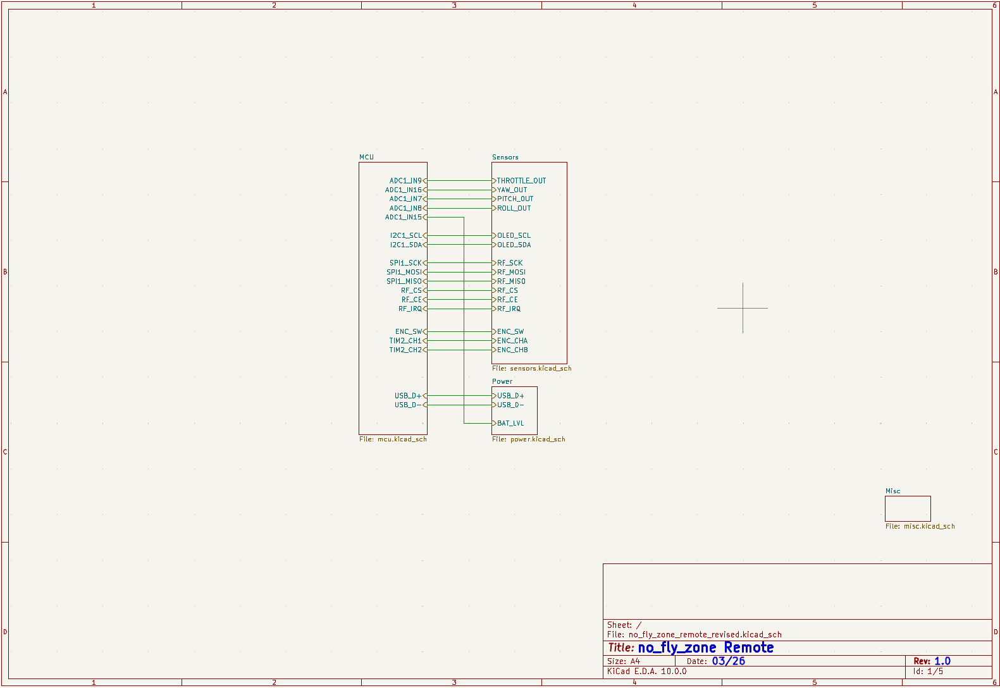
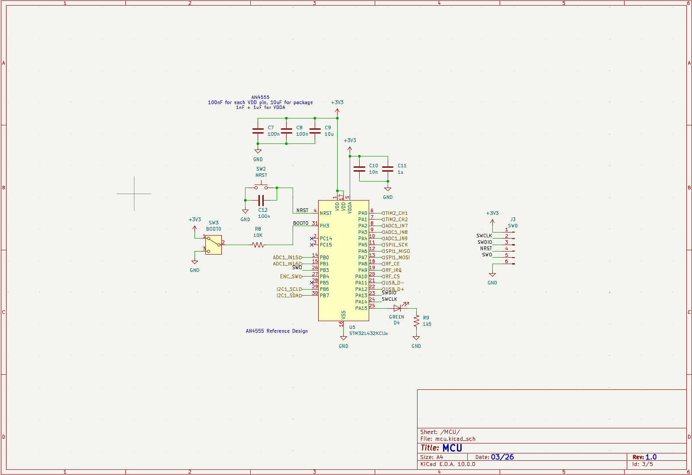
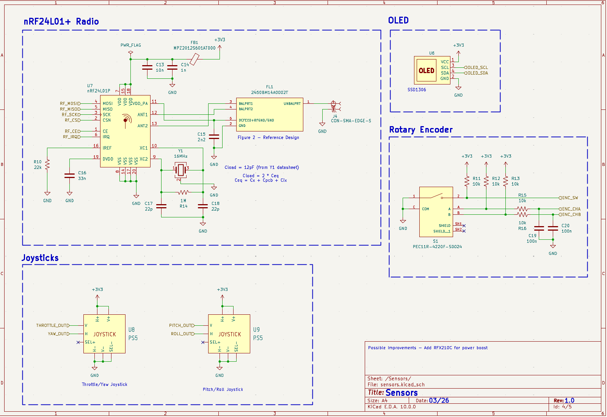
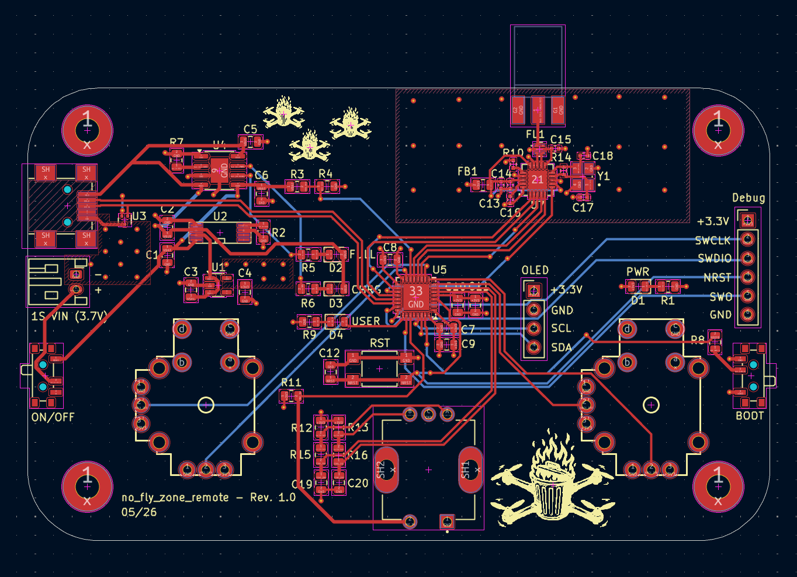
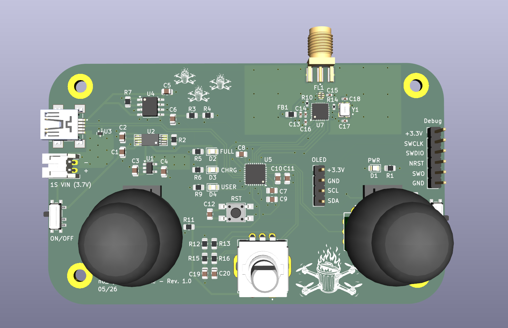

# no_fly_zone_remote Schematic + PCB
## Overview

The remote for this quadcopter requires several things

1. Microcontroller
2. Control Inputs - Joysticks, Encoders
3. Wireless Communication
4. Charging Circuitry
5. OLED

The STM32L432KC microcontroller was chosen for its small package, low power draw, and adequate maximum clock speed. The joysticks, PS5 TMR (Tunnel Magnetoresistance), were chosen due to their low deadzones, small footprint, and wide availability. The joysticks control the quadcopters throttle, yaw, pitch, and roll. The encoder included on the PCB is used to switch between various menus, displayed on the SSD1306 OLED, and for tuning quadcopter PID parameters easily. The nRF24L01 radio was chosen for its high availablity and simplicity in function. The charging circuity involves an autoswitching power multiplexer and a linear 1S LiPo charger. The autoswitcher IC automatically chooses the highest available power source. If only LiPo is connected, it is used to power the remote, but if LiPo and USB power are present, USB power is used to power the board and simultaneously charge the LiPo. The board can also be powered using only USB without a LiPo.

More details are given on the schematics for exact component parameters.

All footprints and schematics symbols were found online or in KiCAD libraries.

## Versions

The folder structure indicates there are two versions of the PCB: original and revised. The original PCB was never manufactured and used the wrong footprints for several parts, as well as did not have great PCB design characteristics. Instead, the revised version was manufactured and shows all correct footprints and better PCB design methodology. 

An important note on the revised version is Revision 1.0 used the wrong TVS diodes for USB D+ and D-, but these were changed to dedicated USB TVS diodes in a later revision.

## Schematics

### Hierarchal Schematic

The hierarchal schematic details how the MCU, sensors, and power schematics are connected.

### MCU

### Sensors (Radio, OLED, Joysticks, Encoder)

### Misc

Contains four M3 screws with pads, not shown for brevity

### PCB

### 3D Model

